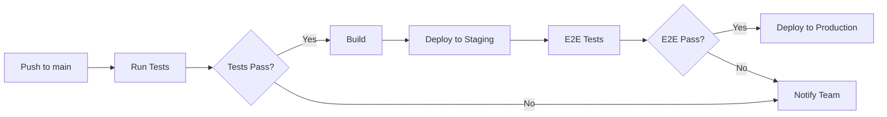

# TSL Intelligence Platform - Implementation Roadmap

## Del 16: Arkitektur & Skalering

### Version History

| Version | Dato | Beskrivelse |
|---------|------|-------------|
| 0.1.0 | 2024-01 | Initial platform setup |
| 0.2.0 | 2024-03 | Data modulering & KPI engine |
| 0.3.0 | 2024-06 | Event engine & Timeline |
| 0.4.0 | 2024-09 | Network Graph & Visualisering |
| 0.5.0 | 2024-11 | Multi-tenant & RBAC |
| 1.0.0 | 2025-Q1 | Production Release (planlagt) |

---

## 🏗️ Implementerede Features (v0.5.0)

### Multi-Tenant System
- ✅ Tenant isolation med row-level filtering
- ✅ RBAC med 5 roller (owner, admin, analyst, viewer, guest)
- ✅ 30+ granulære permissions
- ✅ White-labeling (dynamisk branding, CSS variables, logo)
- ✅ Tenant switching UI
- ✅ API service til tenant konfiguration
- ✅ Audit logging

### Network Graph
- ✅ Lazy loading af noder
- ✅ Clustering for store netværk
- ✅ Farvekodning efter nodetype
- ✅ Relation highlighting
- ✅ Performance optimering

### Data Architecture
- ✅ Domain-drevet struktur
- ✅ KPI modul med beregninger
- ✅ Event engine
- ✅ Enriched data transformers

---

## 📋 Planlagte Features

### v0.6.0 - API & Integration (Q1 2025)
- [ ] REST API med OpenAPI spec
- [ ] GraphQL endpoint
- [ ] Webhook support
- [ ] Third-party integrations (CVR, Virk.dk, etc.)
- [ ] SSO/SAML integration

### v0.7.0 - AI & Automation (Q2 2025)
- [ ] AI-assisteret analyse
- [ ] Automatisk risiko-scoring
- [ ] Anomali-detektion
- [ ] Predictive analytics
- [ ] Natural language queries

### v0.8.0 - Reporting & Export (Q2 2025)
- [ ] Custom report builder
- [ ] Scheduled exports
- [ ] PDF generation forbedringer
- [ ] Excel/CSV export
- [ ] API data export

### v1.0.0 - Production Release (Q3 2025)
- [ ] Performance optimization
- [ ] Security audit
- [ ] Load testing
- [ ] Documentation completion
- [ ] User training materials

---

## 🔧 Arkitektur Oversigt

```
┌─────────────────────────────────────────────────────────────────┐
│                        Frontend (React/TypeScript)               │
├─────────────────────────────────────────────────────────────────┤
│  ┌──────────┐  ┌──────────┐  ┌──────────┐  ┌──────────────────┐ │
│  │ Tenant   │  │ Auth     │  │ Data     │  │ Notification     │ │
│  │ Context  │  │ Context  │  │ Context  │  │ System           │ │
│  └────┬─────┘  └────┬─────┘  └────┬─────┘  └────────┬─────────┘ │
│       │             │             │                  │           │
│  ┌────▼─────────────▼─────────────▼──────────────────▼─────────┐ │
│  │                    Domain Layer                              │ │
│  │  ┌─────────┐ ┌─────────┐ ┌─────────┐ ┌─────────┐            │ │
│  │  │ tenant  │ │ events  │ │ risk    │ │ exec    │  ...       │ │
│  │  └─────────┘ └─────────┘ └─────────┘ └─────────┘            │ │
│  └──────────────────────────────────────────────────────────────┘ │
│                              │                                    │
│  ┌───────────────────────────▼──────────────────────────────────┐ │
│  │                    API Layer                                  │ │
│  │  tenantApi │ dataApi │ authApi │ notificationApi             │ │
│  └──────────────────────────────────────────────────────────────┘ │
└─────────────────────────────────────────────────────────────────┘
                               │
                               ▼
┌─────────────────────────────────────────────────────────────────┐
│                        Backend (Planlagt)                        │
├─────────────────────────────────────────────────────────────────┤
│  ┌──────────┐  ┌──────────┐  ┌──────────┐  ┌──────────────────┐ │
│  │ API      │  │ Auth     │  │ Tenant   │  │ Data             │ │
│  │ Gateway  │  │ Service  │  │ Service  │  │ Service          │ │
│  └──────────┘  └──────────┘  └──────────┘  └──────────────────┘ │
│                              │                                    │
│  ┌───────────────────────────▼──────────────────────────────────┐ │
│  │                    Database Layer                             │ │
│  │  PostgreSQL (multi-tenant) │ Redis (cache) │ S3 (files)      │ │
│  └──────────────────────────────────────────────────────────────┘ │
└─────────────────────────────────────────────────────────────────┘
```

---

## 🔐 Multi-Tenant Arkitektur

### Data Isolation Strategi
```typescript
// Alle data-queries filtreres automatisk på tenantId
interface TenantScoped {
  tenantId: string;
}

// Utility til at scope data
function filterByTenant<T extends TenantScoped>(
  data: T[],
  tenantId: string
): T[] {
  return data.filter(item => item.tenantId === tenantId);
}
```

### RBAC Matrix

| Permission | Owner | Admin | Analyst | Viewer | Guest |
|------------|-------|-------|---------|--------|-------|
| case:create | ✅ | ✅ | ✅ | ❌ | ❌ |
| case:read | ✅ | ✅ | ✅ | ✅ | ✅ |
| case:update | ✅ | ✅ | ✅ | ❌ | ❌ |
| case:delete | ✅ | ✅ | ❌ | ❌ | ❌ |
| case:export | ✅ | ✅ | ✅ | ❌ | ❌ |
| user:invite | ✅ | ✅ | ❌ | ❌ | ❌ |
| settings:update | ✅ | ✅ | ❌ | ❌ | ❌ |
| branding:update | ✅ | ✅ | ❌ | ❌ | ❌ |
| admin:billing | ✅ | ❌ | ❌ | ❌ | ❌ |
| admin:api | ✅ | ❌ | ❌ | ❌ | ❌ |

### White-Labeling

Hvert tenant kan tilpasse:
- **Logo**: Primært og dark mode varianter
- **Favicon**: Custom browser icon
- **Farver**: 15 konfigurerbare farver (primary, accent, etc.)
- **Custom CSS**: Avanceret styling
- **Company Name**: Vises i header og emails

---

## 📊 Performance Mål

| Metrik | Mål | Status |
|--------|-----|--------|
| First Contentful Paint | < 1.5s | ✅ |
| Time to Interactive | < 3.0s | ✅ |
| Bundle Size (gzipped) | < 250KB | ✅ |
| API Response Time | < 200ms | Planlagt |
| Network Graph Render (1000 nodes) | < 500ms | ✅ |

---

## 🧪 Test Coverage

| Domain | Unit Tests | Integration | E2E |
|--------|------------|-------------|-----|
| Tenant | 33 | Planlagt | Planlagt |
| Events | 15 | ✅ | Planlagt |
| Executive | 8 | ✅ | Planlagt |
| Scenarios | 6 | ✅ | Planlagt |
| Settings | 12 | ✅ | Planlagt |

---

## 📁 Fil Struktur

```
src/
├── domains/               # Feature-baserede domæner
│   ├── tenant/           # Multi-tenant system
│   │   ├── types.ts      # Type definitions
│   │   ├── TenantContext.tsx
│   │   ├── TenantSwitcher.tsx
│   │   ├── TenantBranding.tsx
│   │   ├── tenantApi.ts
│   │   ├── tenantIsolation.ts
│   │   └── __tests__/
│   ├── events/           # Event engine
│   ├── executive/        # Executive summary
│   ├── notifications/    # Notification system
│   ├── risk/             # Risk scoring
│   ├── scenarios/        # Scenario modeling
│   ├── settings/         # User preferences
│   └── shared/           # Shared utilities
├── components/           # UI komponenter
├── context/              # React contexts
├── hooks/                # Custom hooks
├── lib/                  # Utilities
├── store/                # Redux store
└── types/                # Global types
```

---

## 🚀 Deploy Pipeline



---

## 📝 Migration Notes

### Fra v0.4.0 til v0.5.0

1. **TenantProvider** skal wrapp'e hele appen:
```tsx
<TenantProvider>
  <App />
</TenantProvider>
```

2. **Data queries** skal bruge tenant hooks:
```tsx
const tenantId = useTenantId();
const data = filterByTenant(allData, tenantId);
```

3. **Feature flags** kontrolleres via context:
```tsx
const hasAI = useFeature('aiAssistant');
const canExport = usePermission('case:export');
```

---

## 📞 Support & Kontakt

- **Teknisk Support**: support@tsl-intelligence.com
- **Documentation**: /docs (internal)
- **Issue Tracker**: GitHub Issues

---

*Sidst opdateret: November 2024*
